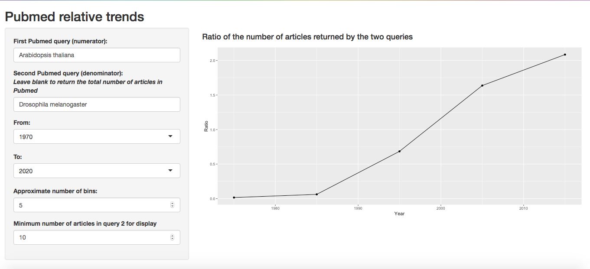

Pubmed Relative Trends
================

This shiny app gets the number of articles returned by two [Pubmed](https://pubmed.ncbi.nlm.nih.gov/) queries and draws a plot of their ratio throughout time. 

Pubmed is a search engine supporting the search in the MEDLINE database of references and abstracts in the life sciences and biomedical fields. 

This app uses the [RISmed](https://cran.r-project.org/web/packages/RISmed/RISmed.pdf) package to retrieve article counts.

## User input

The pubmed queries can be simply a list of keywords, or include field tags and other pubmed specific syntax (see https://pubmed.ncbi.nlm.nih.gov/help). 

Given that ratios can be quite volatile, a minimal value for the denominator can be specified by the user for the data point to be displayed. This value is set to 10 by default.

## Example

<!-- -->

